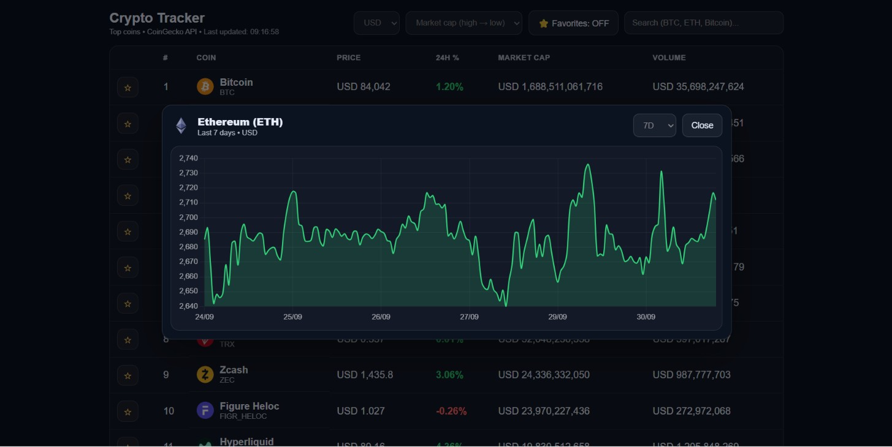

# Crypto Tracker 📈

A responsive cryptocurrency tracking application built with JavaScript and Vite.

## Features

- Cryptocurrency market prices and information
- Search by coin name or symbol
- Sort by price, market cap, and 24-hour change
- Switch between USD and NOK
- Save favorite cryptocurrencies
- Interactive historical price charts
- Automatic data refresh every 3 minutes
- Responsive layout for desktop and mobile
- Loading states and error handling

## Technologies

- HTML5
- CSS3
- JavaScript (ES6 Modules)
- Vite
- Axios
- Chart.js
- date-fns
- CoinGecko API
- LocalStorage

## Getting Started

1. Clone the repository.
2. Install dependencies:

   npm install

3. Start the development server:

   npm run dev

## Data Source

Cryptocurrency data is provided by the CoinGecko API.
API rate limits may occasionally affect data availability.

## Author

**Fatimah Sakhnine**

GitHub: https://github.com/Fatimah-sk
